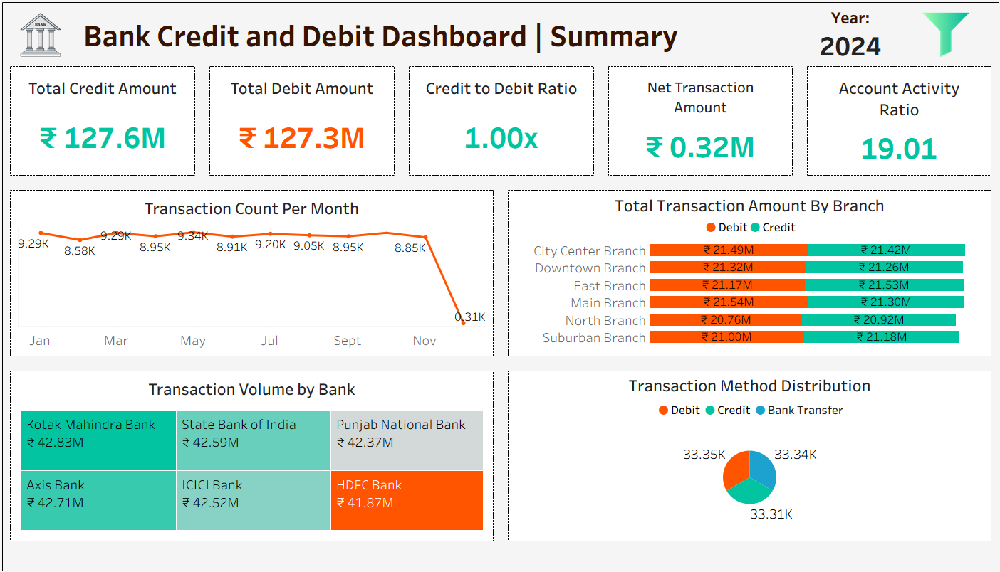
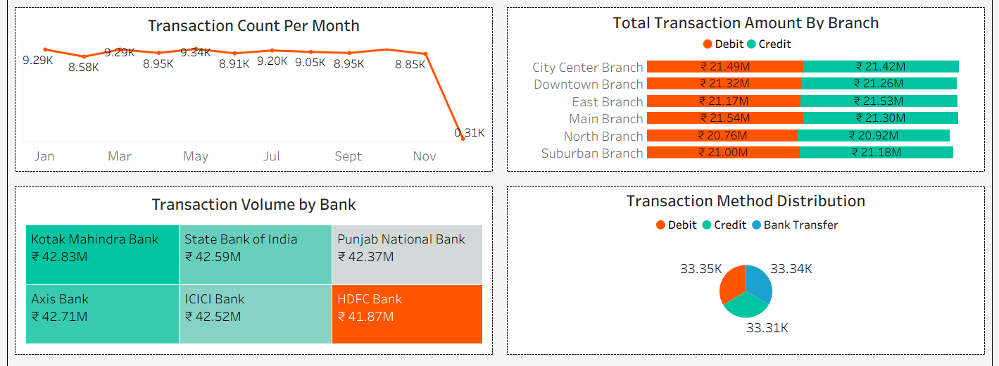

# Bank Credit & Debit Analytics Dashboard (Tableau + SQL)

## Project Overview
This project focuses on analyzing **banking credit and debit transactions** to derive meaningful business insights using **Excel Power Query, Tableau Public, and SQL Server**.

The dataset contains **100,000 transaction records**, and the objective was to:
- Clean and prepare raw banking data
- Build interactive and dynamic dashboards in Tableau
- Write analytical SQL queries for real-world banking scenarios
- Present insights that help banks understand transaction behavior, risk, and performance

---

## Dataset Description
**Original File Name:** Credit and debit banking data  

**Columns:**
- Customer_ID  
- Customer_Name  
- Account_Number  
- Transaction_Date  
- Transaction_Type  
- Amount  
- Balance  
- Description  
- Branch  
- Transaction_Method  
- Currency  
- Bank_Name  

---

## Data Cleaning & Preparation (Excel Power Query)
Power Query was used to clean, transform, and enrich the dataset.

### Key transformations:
- Handled null and inconsistent values
- Standardized transaction types (Credit / Debit)
- Created derived columns for analytics

### New columns created:
- Credit_Amount  
- Debit_Amount  
- Net_Transaction_Amount  
- Transaction_Day  
- Transaction_Week  
- Transaction_Month  
- Transaction_Count  
- High_Risk_Transaction_Flag  

The cleaned dataset was saved in:
- `.xlsx` format (for Tableau)
- `.csv` format (for SQL Server)

---

## Tableau Dashboard
The Tableau dashboard was designed to be **dynamic, interactive, and business-friendly**.

### Dashboard Structure:
- Vertical and horizontal containers for clear layout
- KPI section at the top
- Charts arranged using nested containers
- Interactive filters and parameters

### KPIs Built:
1. Total Credit Amount  
2. Total Debit Amount  
3. Credit to Debit Ratio  
4. Net Transaction Amount  
5. Account Activity Ratio  

### Charts Included:
- Transactions per Day / Week / Month (parameter-driven)
- Total Transaction Amount by Branch
- Transaction Volume by Bank
- Transaction Method Distribution
- High-Risk Transaction Identification

### Filters & Interactivity:
- Bank Name
- Branch
- View By (Day / Week / Month)
- Description-wise filter
- Dynamic parameters and calculated fields

### Tableau Public Link:
🔗 https://public.tableau.com/app/profile/vivek.kumar5959/viz/BankCreditandDebitDashboard/BankCreditandDebitDashboard

---

## SQL Analysis (MS SQL Server)

The cleaned CSV file was imported into SQL Server.

### Database Details:
- **Database Name:** BANK_ANALYTICS
- **Table Name:** BANK_TRANSACTION

### SQL Problems Solved:
1. Total number of transactions, total debit amount, total credit amount  
2. Branch-wise transaction volume and transaction value  
3. Average transaction amount by transaction type  
4. Month-on-month growth in total transaction amount  
5. Weekend vs weekday transaction comparison  
6. Suspicious days where debit amount exceeds credit amount by 20%  
7. Branch-wise top 5 customers by transaction amount  
8. Customers with multiple accounts  
9. Accounts with transaction amount above overall average  
10. Running balance per account  
11. Top 3 transactions per account  
12. Debit to credit ratio by branch  
13. Monthly banking KPI view  
14. Customer 360 view  

All queries are written using:
- Window functions
- CTEs
- Aggregations
- Business-safe calculations (NULL handling, divide-by-zero protection)

---

## Business Insights Derived

### 1. Credit vs Debit Behavior
The analysis highlights a clear balance pattern between credit inflows and debit outflows across banks and branches. While overall credit volumes remain slightly higher, certain branches exhibit a **debit-dominant behavior**, indicating higher customer withdrawals or spending activity. This insight helps banks identify branches that may require improved liquidity planning or targeted deposit campaigns.

---

### 2. Branch-Level Performance Variation
Transaction volume and transaction value are not evenly distributed across branches. A few branches contribute a disproportionately higher share of total transaction amounts, indicating **regional concentration of banking activity**. These branches can be prioritized for premium services, staffing optimization, and infrastructure upgrades.

---

### 3. Bank-Wise Transaction Concentration
Transaction volume by bank shows that a limited number of banks handle the majority of transactions. This concentration suggests strong customer trust and higher adoption rates for specific banks. Smaller banks may need to enhance digital offerings or customer engagement strategies to compete effectively.

---

### 4. Temporal Transaction Trends (Day / Week / Month)
Transaction analysis over time reveals:
- Higher activity during specific months, indicating **seasonal transaction patterns**
- Increased transaction counts on weekdays compared to weekends
- Weekly patterns where mid-week days often show peak activity

These trends can help banks optimize system load, staffing, and promotional timing.

---

### 5. Account Activity Ratio Insights
The Account Activity Ratio highlights how actively customers transact relative to their account balances. Accounts with **high activity but relatively lower balances** indicate frequent usage, making them strong candidates for cross-selling products such as credit cards, overdraft facilities, or micro-loans. Conversely, accounts with high balances but low activity may represent idle funds.

---

### 6. High-Risk Transaction Identification
High-risk transactions-flagged based on unusually large amounts or irregular patterns-are concentrated within specific periods and branches. Monitoring these transactions helps banks strengthen **fraud detection mechanisms** and apply additional compliance checks where required.

---

### 7. Customer Concentration Risk
A small segment of customers accounts for a significant portion of total transaction value. While these high-value customers are important revenue drivers, over-reliance on a limited customer base introduces **concentration risk**. Diversifying customer engagement can help reduce dependency on a few accounts.

---

### 8. Multi-Account Customer Behavior
Customers holding multiple accounts tend to show higher transaction volumes and balances, indicating stronger engagement with the bank. These customers can be targeted for relationship-based products such as wealth management services and personalized financial solutions.

---

### 9. Transaction Method Preferences
Digital transaction methods dominate overall transaction counts, reflecting a strong shift toward **cashless and online banking**. However, traditional methods still hold relevance in certain branches, suggesting uneven digital adoption across regions.

---

### 10. Strategic Business Impact
Overall, the dashboard and SQL analysis provide actionable insights for:
- Liquidity and cash flow planning
- Fraud and risk monitoring
- Branch and bank performance benchmarking
- Customer segmentation and targeting
- Data-driven decision-making for banking operations

This project demonstrates how transactional data can be transformed into meaningful insights that support both operational efficiency and strategic growth.

---

## Tools & Technologies Used
- Excel Power Query (Data Cleaning & Transformation)
- Tableau Public (Dashboard & Visualization)
- MS SQL Server (Data Analysis)
- GitHub (Version Control & Portfolio)

---

## Dataset Access
The dataset used in this project contains 100,000 banking transactions.
Due to file size limitations, the full dataset is hosted externally.

📂 Dataset (Excel & CSV):  
(https://drive.google.com/drive/folders/1-hHugYJFljfBs1cGIXVk8aYpwNniaHU3?usp=sharing)

---

## Tableau Dashboard Preview

### Overall Dashboard

### KPI Section

### Charts Section

---

## Author
**Vivek Kumar**  
Data Analyst | SQL | Tableau | Excel  

🔗 Tableau Public: https://public.tableau.com/app/profile/vivek.kumar5959  
🔗 GitHub: (https://github.com/vivekranu1/)

---

## Note
This project is created for learning, portfolio development, and real-world analytical practice using banking transaction data.
##  If you find this project useful
Please ⭐ star the repository - it helps showcase my work to recruiters!
